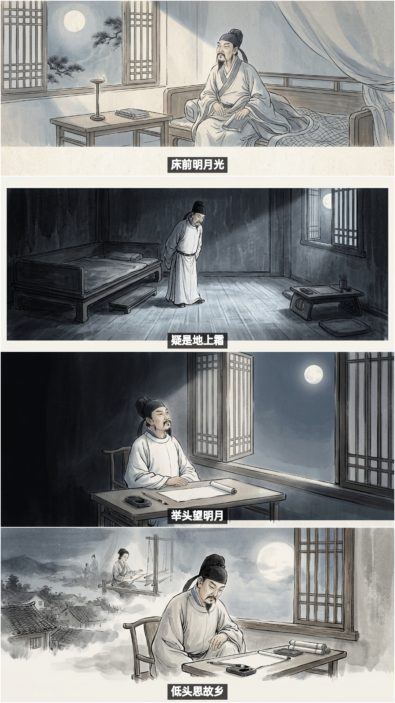
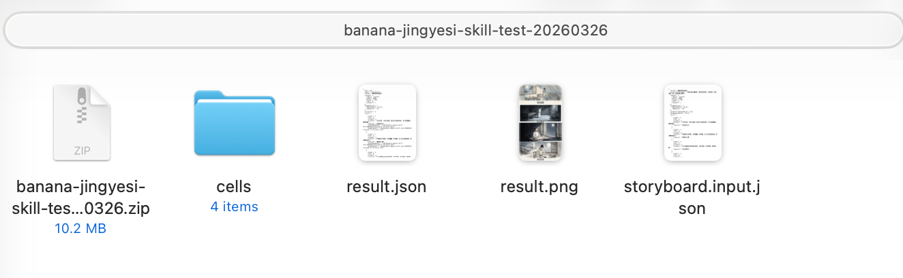
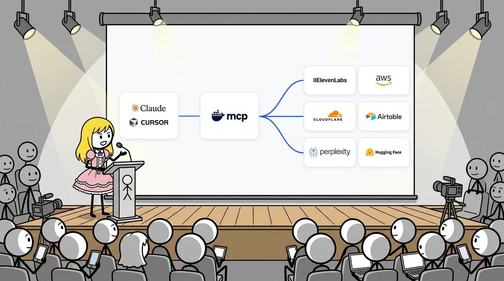
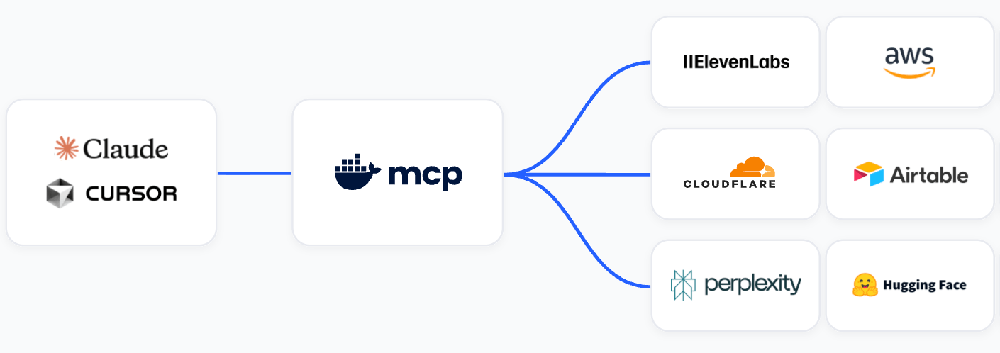
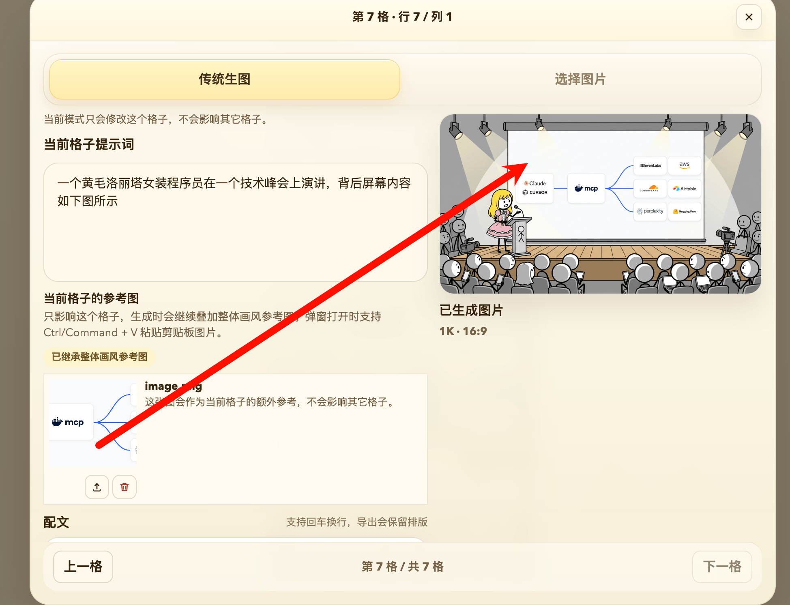
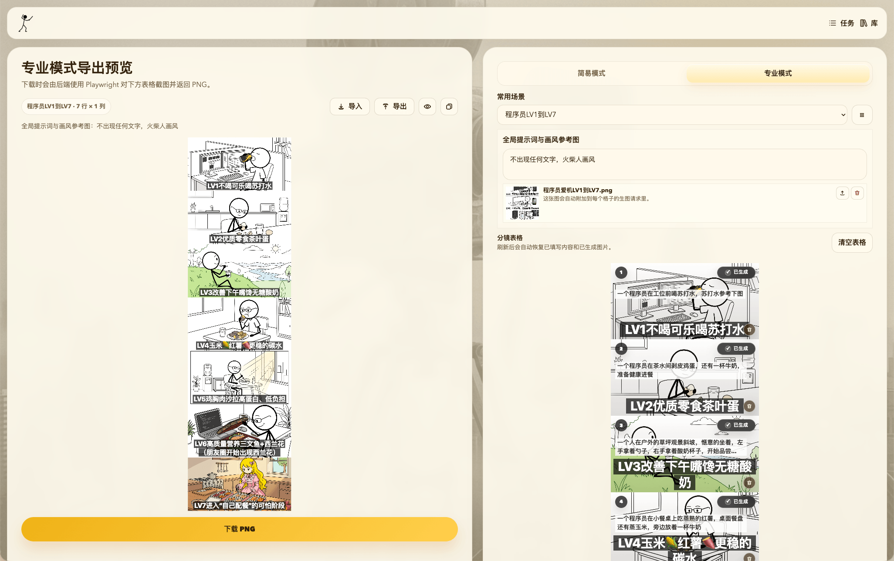
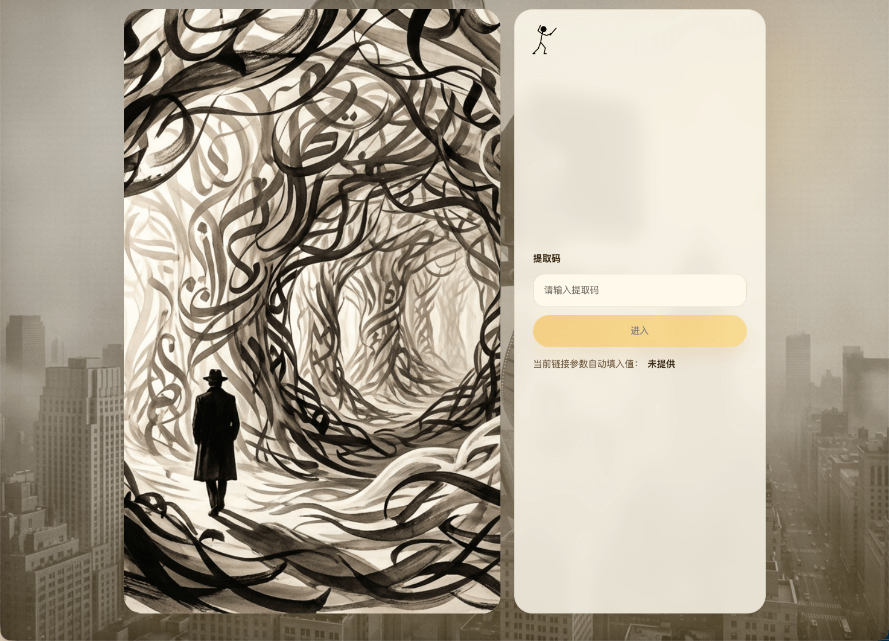

# Banana Studio 使用SKill生成分镜图片

一款开源的banana生图拼图小工具，适合轻度自媒体条漫爱好者，zhaoolee自用已在🍠涨粉3K，账号[程序员梗图火炬](https://www.xiaohongshu.com/user/profile/566a6d770bf90c7076c1f397), 欢迎品鉴效果。


## Skill生成故事配图

```
使用skill banana-studio-generate 生成分镜图，图片本身不需要任何文字。布局可以自定义，这次使用宽度为1080px的一列四行布局，风格为中国古典水墨，人物统一，李白头像参考图为 https://cdn.fangyuanxiaozhan.com/assets/aaa919414a090a3a8c5e2828b18e213df5e39949b2e657eae427854549337d9a.png

请基于以下四句诗生成分镜：

床前明月光
疑是地上霜
举头望明月
低头思故乡

把诗文作为分镜的配文，配文使用工具的能力
```





## 生成小红书条漫

| 程序员饮食LV1到LV7 | 程序员狠话LV1到LV7 |
| --- | --- |
|  |  |


## 解决的痛点

- 一个格子效果有问题，就只重新生成一小格，省钱！
- 隔离上下文污染，为单个格子提供参考图，比如banana不认识cursor的图标，就可以对单格提供cursor图标
- 消除中文鬼画符现象，将图片里面的文字拆分到input，让生图模型只负责
- 支持自定义画板尺寸，动态调整行列格子数
- 根据小格长宽比，自动化匹配最接近的生图长宽比，减少生图的画面裁剪


每个格子都可以上传独立的参考图，方便生图

| 生图效果 | 参考图 |
| --- | --- |
|  |  |




- 支持实时预览导出效果



- 支持通过提取码分享给朋友




## 部署方式

运行 gcloud auth application-default login 完成登陆，获取Vertex ADC认证文件
保证 `${HOME}/.config/gcloud/application_default_credentials.json` 存在

```
git clone https://github.com/zhaoolee/banana
cd banana
cp .env.example .env
# 按需修改 .env 中的配置
docker compose up -d --build
```
启动成功后即可在 http://127.0.0.1:23001 访问, 输入默认提取码 banana 即可
